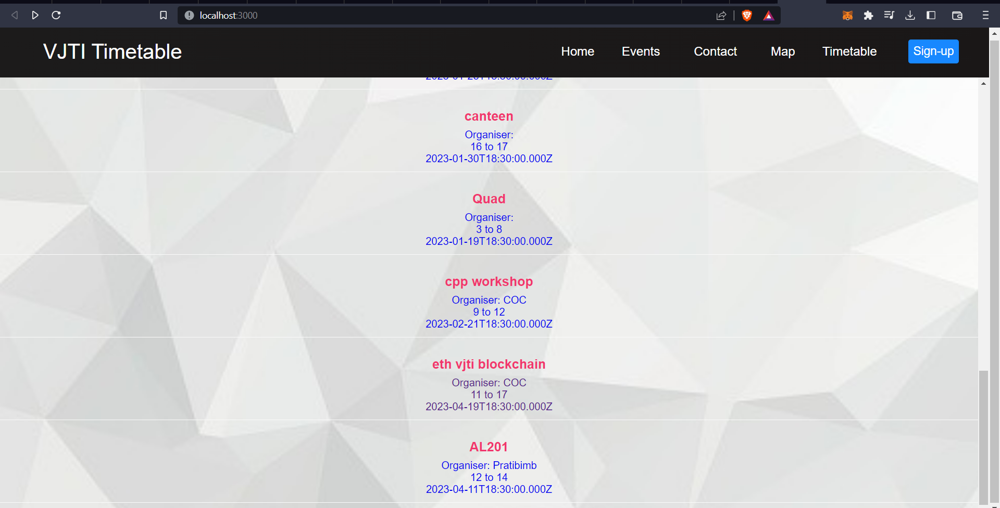
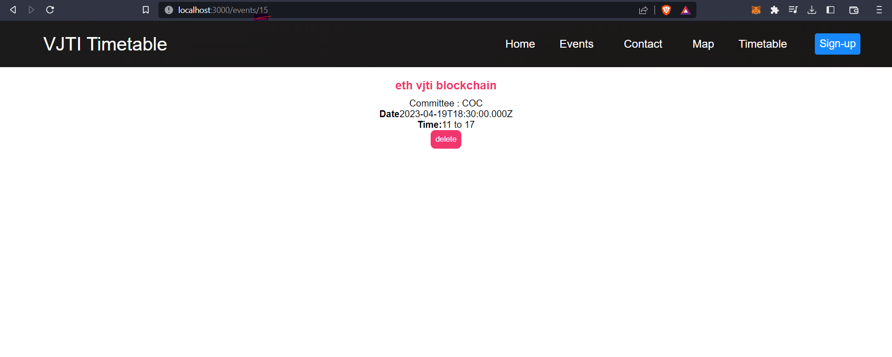
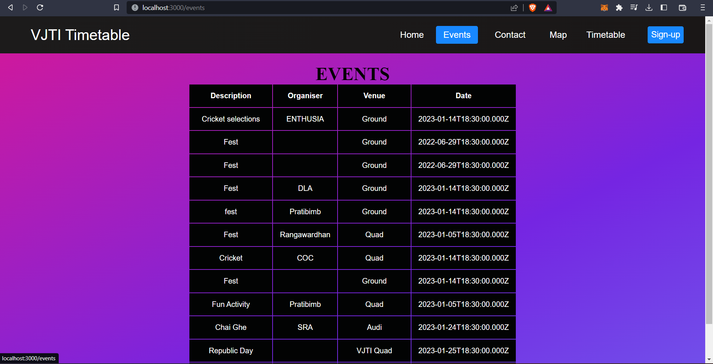
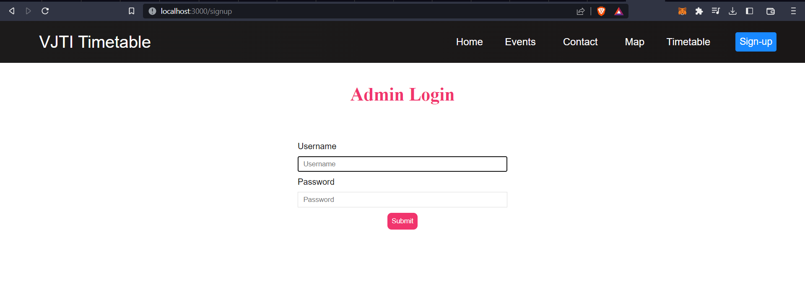

# Institute Level Timetable 

This project focuses on avoiding overlapping events and ease the classroom allotment process .  

**Work In Progress**

Future Milestones : send alert when there is a possibility of rush in the hallway , staggared lunch breaks etc. 
**Screenshots**
***Home page***

***Events page***

***Admin Login***

